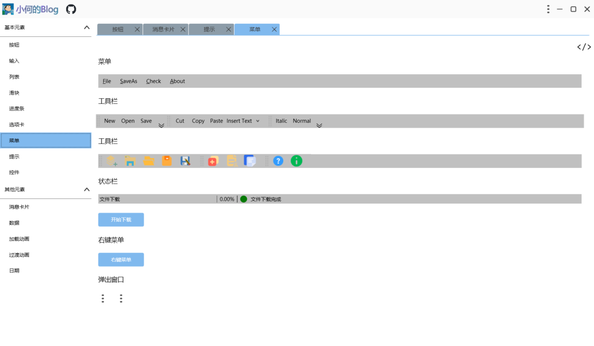
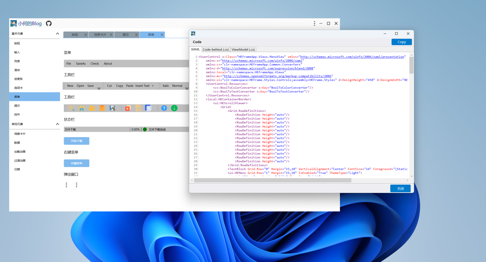
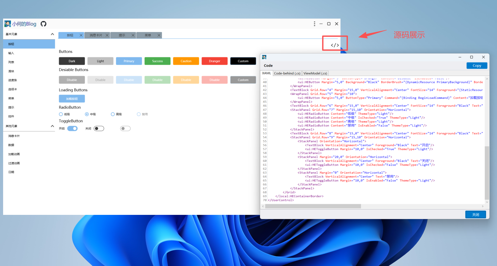

# HEFrame.WpfUI 控件库

<div align="center">
  
  <h3>现代化、美观的 WPF UI 控件库</h3>
</div>
## 📚 目录

- [简介](#简介)
- [特性](#特性)
- [安装与引用](#安装与引用)
- [快速开始](#快速开始)
- [控件列表](#控件列表)
  - [按钮控件](#按钮控件)
  - [输入控件](#输入控件)
  - [列表控件](#列表控件)
  - [滑块控件](#滑块控件)
  - [进度条控件](#进度条控件)
  - [选项卡控件](#选项卡控件)
  - [菜单控件](#菜单控件)
  - [提示控件](#提示控件)
  - [控件](#控件)
  - [消息卡片控件](#消息卡片控件)
  - [数据控件](#数据控件)
  - [加载动画控件](#加载动画控件)
  - [过渡动画控件](#过渡动画控件)
  - [日期控件](#日期控件)
- [主题定制](#主题定制)
- [贡献指南](#贡献指南)
- [许可证](#许可证)

## 📋 简介

HEFrame.WpfUI 是一个现代化的 WPF UI 控件库，提供了丰富的自定义控件和样式，帮助开发者快速构建美观、专业的桌面应用程序。该控件库遵循现代设计理念，支持源码、展示主题切换、动画效果，并且完全兼容 MVVM 设计模式。





## ✨ 特性

- **丰富的控件集合**：包含 30+ 种常用控件，满足各类应用场景
- **现代化设计**：遵循扁平化、简约的设计风格
- **主题定制**：支持亮色/暗色主题切换，可自定义主题色
- **动画效果**：内置多种过渡动画和加载动画
- **MVVM 友好**：所有控件均支持数据绑定和命令绑定
- **易于集成**：简单的引用方式，快速集成到现有项目

## 📥 安装与引用

1. 克隆仓库
   ```bash
   git clone https://github.com/he-ze-xi/HEFrame.WpfUI
   ```

2. 打开Visual Studio编译项目代码

3. 在编译完的bin目录找到`HEFrame.Core.dll` 和 `HEFrame.Styles.dll`，在你的 WPF 项目中添加对这两个 DLL 的引用

## 🚀 快速开始

### 1. 添加资源字典

在你的 `App.xaml` 文件中添加以下资源字典：

```xml
    <Application.Resources>
        <ResourceDictionary>
            <ResourceDictionary.MergedDictionaries>
                <ResourceDictionary Source="pack://application:,,,/HEFrame.Styles;component/Themes/Generic.xaml" />
            </ResourceDictionary.MergedDictionaries>
        </ResourceDictionary>
    </Application.Resources>
```

### 2. 添加命名空间

在 XAML 文件中添加以下命名空间：

```xml
xmlns:ui="clr-namespace:HEFrame.Styles.Controls;assembly=HEFrame.Styles"
```

### 3. 使用控件

现在你可以在 XAML 中使用 HEFrame 控件了：

```xml
<ui:HEButton Content="点击我" ButtonType="Primary" />
<ui:HETextBox Grid.Row="3" Margin="15,10" ThemeType="Light" WaterMark="我是水印文字" />
...
```

Demo界面点击右上角按钮可以看到每个xaml页面的引用代码示例，使用者可以更直观看到每个控件的用法：



## 📦 控件列表

### 按钮控件

#### 1. HEButton

- `ButtonType`：按钮类型（Primary, Success, Caution, Dranger, Dark, Light, Custom）
- `IsLoading`：是否显示加载状态
- `LoadingContent`：加载状态显示的文本

```xml
<!-- 基本用法 -->
<ui:HEButton Content="主要按钮" ButtonType="Primary" />
<ui:HEButton Content="成功按钮" ButtonType="Success" />
<ui:HEButton Content="警告按钮" ButtonType="Caution" />
<ui:HEButton Content="危险按钮" ButtonType="Dranger" />
<ui:HEButton Content="深色按钮" ButtonType="Dark" />
<ui:HEButton Content="浅色按钮" ButtonType="Light" />

<!-- 禁用状态 -->
<ui:HEButton Content="禁用按钮" ButtonType="Primary" IsEnabled="False" />

<!-- 加载状态 -->
<ui:HEButton Content="加载按钮" 
             ButtonType="Primary" 
             IsLoading="{Binding IsLoading}" 
             LoadingContent="加载中..." />

<!-- 自定义样式 -->
<ui:HEButton Content="自定义按钮" 
             ButtonType="Custom" 
             Background="Black" 
             Foreground="White" 
             BorderBrush="{DynamicResource PrimaryBackground}" 
             BorderThickness="1" 
             HoverBackground="{DynamicResource PrimaryMouseHover}" />
```

#### 2. HEToggleButton

- `ThemeType`：主题类型（Light, Dark）
- `IsChecked`：是否选中

```xml
<ui:HEToggleButton ThemeType="Light" IsChecked="{Binding IsActive}" />
```

#### 3. HERadioButton

```xml
<ui:HERadioButton Content="选项1" GroupName="Options" IsChecked="True" />
<ui:HERadioButton Content="选项2" GroupName="Options" />
```

#### 4. HECheckBox

```xml
<ui:HECheckBox Content="选择我" IsChecked="{Binding IsSelected}" />
```

### 输入控件

#### 5. HETextBox

```xml
<ui:HETextBox Watermark="请输入用户名" Text="{Binding Username}" />
```

#### 6. HEPasswordBox

```xml
<ui:HEPasswordBox Watermark="请输入密码" Password="{Binding Password}" />
```

#### 7. HEComboBox

```xml
<ui:HEComboBox ItemsSource="{Binding Options}" 
               DisplayMemberPath="Name" 
               SelectedValuePath="Id" 
               SelectedValue="{Binding SelectedId}" />
```

### 列表控件

#### 8. HEListView

```xml
<ui:HEListView ItemsSource="{Binding Items}">
    <ui:HEListView.ItemTemplate>
        <DataTemplate>
            <TextBlock Text="{Binding Name}" />
        </DataTemplate>
    </ui:HEListView.ItemTemplate>
</ui:HEListView>
```

#### 9. HEListBox

```xml
<ui:HEListBox ItemsSource="{Binding Items}" 
              SelectedItem="{Binding SelectedItem}">
    <ui:HEListBox.ItemTemplate>
        <DataTemplate>
            <TextBlock Text="{Binding Name}" />
        </DataTemplate>
    </ui:HEListBox.ItemTemplate>
</ui:HEListBox>
```

### 滑块控件

#### 10. HESlider

```xml
<ui:HESlider Minimum="0" 
             Maximum="100" 
             Value="{Binding SliderValue}" 
             TickFrequency="10" 
             IsSnapToTickEnabled="True" />
```

### 进度条控件

#### 11. HEProgressBar

```xml
<ui:HEProgressBar Value="{Binding Progress}" Maximum="100" />
```

### 选项卡控件

#### 12. HETabControl

- `ThemeType`：主题类型（Light, Dark）
- `SelectionChangedCommand`：选项卡切换命令

**示例：**
```xml
<ui:HETabControl ThemeType="Light" 
                 ItemsSource="{Binding TabItems}" 
                 SelectedIndex="{Binding SelectedIndex, Mode=TwoWay}" 
                 SelectionChangedCommand="{Binding SwitchPageCommand}">
    <ui:HETabControl.ItemTemplate>
        <DataTemplate>
            <TextBlock Text="{Binding Header}" />
        </DataTemplate>
    </ui:HETabControl.ItemTemplate>
    <ui:HETabControl.ContentTemplate>
        <DataTemplate>
            <ContentControl Content="{Binding Content}" />
        </DataTemplate>
    </ui:HETabControl.ContentTemplate>
</ui:HETabControl>
```

### 菜单控件

#### 13. HEExpanderMenu

- `Header`：菜单标题
- `MenuItems`：菜单项集合
- `MenuSwitchCommand`：菜单切换命令
- `ThemeType`：主题类型（Light, Dark）

```xml
<ui:HEExpanderMenu Header="系统设置" 
                   MenuItems="{Binding MenuItems}" 
                   MenuSwitchCommand="{Binding PageSwitchCommand}" 
                   ThemeType="Light" />
```

#### 14. HEContextMenu

```xml
<TextBlock Text="右键点击我">
    <TextBlock.ContextMenu>
        <ui:HEContextMenu>
            <MenuItem Header="复制" Command="{Binding CopyCommand}"/>
            <MenuItem Header="粘贴" Command="{Binding PasteCommand}"/>
        </ui:HEContextMenu>
    </TextBlock.ContextMenu>
</TextBlock>
```

### 提示控件

#### 15. HEToolTip

```xml
<Button Content="鼠标悬停查看提示">
    <ui:HEToolTip.ToolTip>
        <ui:HEToolTip Content="这是一个自定义工具提示" />
    </ui:HEToolTip.ToolTip>
</Button>
```

### 控件

#### 16. HEGroupBox

```xml
<ui:HEGroupBox Header="基本信息">
    <StackPanel>
        <ui:HETextBox Watermark="姓名" />
        <ui:HETextBox Watermark="年龄" />
    </StackPanel>
</ui:HEGroupBox>
```

#### 17. HEExpander

```xml
<ui:HEExpander Header="详细信息">
    <StackPanel>
        <TextBlock Text="这里是详细信息内容" />
    </StackPanel>
</ui:HEExpander>
```

### 消息卡片控件

#### 18. HEMessageCard

```xml
<ui:HEMessageCardHost ShowDirection="FromTop" />

<!-- 在代码中使用 -->
HEMessageService.SendMessage("操作成功", MessageType.Success, "GlobalMessageToken");
```

### 数据控件

#### 19. HEDataGrid

```xml
<ui:HEDataGrid ItemsSource="{Binding DataList}" 
               AutoGenerateColumns="False">
    <ui:HEDataGrid.Columns>
        <DataGridTextColumn Header="姓名" Binding="{Binding Name}" />
        <DataGridTextColumn Header="年龄" Binding="{Binding Age}" />
        <DataGridCheckBoxColumn Header="是否激活" Binding="{Binding IsActive}" />
    </ui:HEDataGrid.Columns>
</ui:HEDataGrid>
```

### 加载动画控件

#### 20. HELoadingAnimation

- `AnimationType`：动画类型（Default, CircleArrow, CirclePoint, CircleLine, LinePoint）
- `IsActive`：是否激活动画
- `LoadingContent`：加载提示文本

```xml
<ui:HELoadingAnimation AnimationType="CircleArrow" 
                       IsActive="{Binding IsLoading}" 
                       LoadingContent="正在加载数据..." />
```

### 过渡动画控件

#### 21. HETransitionAnimation

- `TransitionType`：过渡类型（Fade, Slide, Zoom, Flip）
- `IsStartAnimation`：是否启动动画

```xml
<ui:HETransitionAnimation TransitionType="{Binding TransitionType}" 
                          IsStartAnimation="true">
    <ContentControl Content="{Binding CurrentPage}" />
</ui:HETransitionAnimation>
```

### 日期控件

#### 22. HEDatePicker

```xml
<ui:HEDatePicker SelectedDate="{Binding SelectedDate}" />
```

#### 23. HECalendar

```xml
<ui:HECalendar SelectedDate="{Binding SelectedDate}" 
               DisplayDate="{Binding DisplayDate}" 
               SelectionMode="SingleDate" />
```

## 🎨 主题定制

HEFrame.WpfUI 支持主题定制，你可以通过修改资源字典来自定义主题。

### 切换亮色/暗色主题

```xml
<!-- 亮色主题 -->
<ResourceDictionary Source="pack://application:,,,/HEFrame.Styles;component/HEStyles/Default/LightTheme.xaml" />

<!-- 暗色主题 -->
<ResourceDictionary Source="pack://application:,,,/HEFrame.Styles;component/HEStyles/Default/DarkTheme.xaml" />
```

### 自定义主题色

你可以在应用程序资源中覆盖默认颜色：

```xml
<Application.Resources>
    <ResourceDictionary>
        <!-- 自定义主题色 -->
        <SolidColorBrush x:Key="PrimaryBackground" Color="#1890FF" />
        <SolidColorBrush x:Key="PrimaryMouseHover" Color="#40A9FF" />
        <SolidColorBrush x:Key="PrimaryMouseDown" Color="#096DD9" />
        
        <ResourceDictionary.MergedDictionaries>
            <!-- 其他资源字典 -->
        </ResourceDictionary.MergedDictionaries>
    </ResourceDictionary>
</Application.Resources>
```

## 👨‍💻 贡献指南

欢迎贡献代码或提出建议！请遵循以下步骤：

1. Fork 本仓库
2. 创建你的特性分支 (`git checkout -b feature/amazing-feature`)
3. 提交你的更改 (`git commit -m 'Add some amazing feature'`)
4. 推送到分支 (`git push origin feature/amazing-feature`)
5. 开启一个 Pull Request

---

<div align="center">
  <p>Made with ❤️ by 小何的Blog</p>
</div>